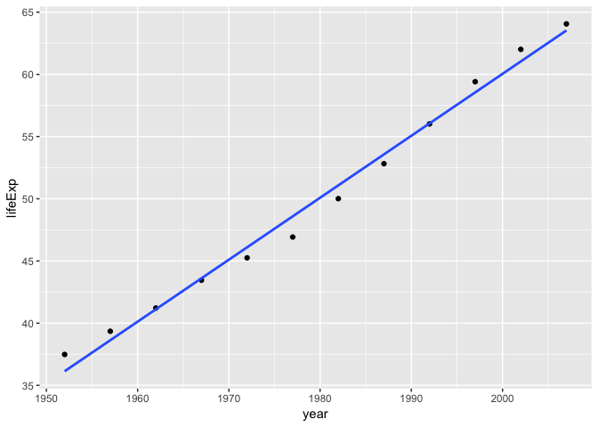
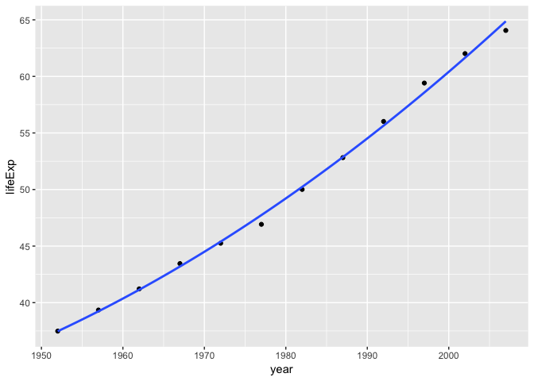

hw06-Ninadh
================
Ninadh
November 6, 2018

This is the first assignment of STAT 547M (despite it being named Homework 06). The task is to complete two of the six topics.

Let's load up!

Task 2: Write function

Write one (or more) functions that do something useful to pieces of the Gapminder or Singer data. It is logical to think about computing on the mini-data frames corresponding to the data for each specific country, location, year, band, album, … This would pair well with the prompt below about working with a nested data frame, as you could apply your function there. Make it something you can’t easily do with built-in functions.

Make it something that’s not trivial to do with the simple dplyr verbs. The linear regression function presented here is a good starting point. You could generalize that to do quadratic regression (include a squared term) or use robust regression, using `MASS::rlm()` or `robustbase::lmrob()`.

``` r
#lets take a look at the dataframe 
gapminder 
```

    ## # A tibble: 1,704 x 6
    ##    country     continent  year lifeExp      pop gdpPercap
    ##    <fct>       <fct>     <int>   <dbl>    <int>     <dbl>
    ##  1 Afghanistan Asia       1952    28.8  8425333      779.
    ##  2 Afghanistan Asia       1957    30.3  9240934      821.
    ##  3 Afghanistan Asia       1962    32.0 10267083      853.
    ##  4 Afghanistan Asia       1967    34.0 11537966      836.
    ##  5 Afghanistan Asia       1972    36.1 13079460      740.
    ##  6 Afghanistan Asia       1977    38.4 14880372      786.
    ##  7 Afghanistan Asia       1982    39.9 12881816      978.
    ##  8 Afghanistan Asia       1987    40.8 13867957      852.
    ##  9 Afghanistan Asia       1992    41.7 16317921      649.
    ## 10 Afghanistan Asia       1997    41.8 22227415      635.
    ## # ... with 1,694 more rows

Let me filter my country, Bangladesh

``` r
gapminder %>%
  filter(country == "Bangladesh") %>%
  knitr::kable()
```

| country    | continent |  year|  lifeExp|        pop|  gdpPercap|
|:-----------|:----------|-----:|--------:|----------:|----------:|
| Bangladesh | Asia      |  1952|   37.484|   46886859|   684.2442|
| Bangladesh | Asia      |  1957|   39.348|   51365468|   661.6375|
| Bangladesh | Asia      |  1962|   41.216|   56839289|   686.3416|
| Bangladesh | Asia      |  1967|   43.453|   62821884|   721.1861|
| Bangladesh | Asia      |  1972|   45.252|   70759295|   630.2336|
| Bangladesh | Asia      |  1977|   46.923|   80428306|   659.8772|
| Bangladesh | Asia      |  1982|   50.009|   93074406|   676.9819|
| Bangladesh | Asia      |  1987|   52.819|  103764241|   751.9794|
| Bangladesh | Asia      |  1992|   56.018|  113704579|   837.8102|
| Bangladesh | Asia      |  1997|   59.412|  123315288|   972.7700|
| Bangladesh | Asia      |  2002|   62.013|  135656790|  1136.3904|
| Bangladesh | Asia      |  2007|   64.062|  150448339|  1391.2538|

To use the linear regression function for the dataframe, lets use a variable for the dataset and plot it.

``` r
gap_ban <- (gapminder %>%
  filter(country == "Bangladesh"))
```

``` r
ggplot(gap_ban, aes(x=year, y= lifeExp)) +
  geom_point() +
  geom_smooth(method = "lm", se = FALSE) 
```



I had no idea that it wound be such a good graph. the linear regression is a good formula as most of the dots fall on the line.

to use linear regression for the above data:

``` r
lm(formula = lifeExp ~ year, data = gap_ban)
```

    ## 
    ## Call:
    ## lm(formula = lifeExp ~ year, data = gap_ban)
    ## 
    ## Coefficients:
    ## (Intercept)         year  
    ##   -936.2158       0.4981

``` r
coef(lm(formula = lifeExp ~ year, data = gap_ban))
```

    ##  (Intercept)         year 
    ## -936.2157744    0.4981308

Let's now try the quadratic function on the same data

``` r
gap_ban_quad <- lm(formula = lifeExp ~ I(year) + I(year^2), data = gap_ban)
coef(gap_ban_quad)
```

    ##   (Intercept)       I(year)     I(year^2) 
    ##  1.049315e+04 -1.105048e+01  2.917053e-03

I always like graphical presentaion of my data.

``` r
ggplot(gap_ban, aes(x=year, y=lifeExp)) +
  geom_point() +
  geom_smooth(method = "lm", formula = y ~ x + I(x^2), se = FALSE)
```



Well, the quadraic formula is a good fit as well.

Task 06: Work with a nested data frame

to make my life easier.
=======================

Create a nested data frame and map a function over the list column holding the nested data. Use list extraction or other functions to pull interesting information out of these results and work your way back to a simple data frame you can visualize and explore.

nesting the dataframe by country and continent (following Jenny's footsteps)
============================================================================

``` r
gapminder %>%
  group_by(country, continent) %>%
  nest()
```

    ## # A tibble: 142 x 3
    ##    country     continent data             
    ##    <fct>       <fct>     <list>           
    ##  1 Afghanistan Asia      <tibble [12 × 4]>
    ##  2 Albania     Europe    <tibble [12 × 4]>
    ##  3 Algeria     Africa    <tibble [12 × 4]>
    ##  4 Angola      Africa    <tibble [12 × 4]>
    ##  5 Argentina   Americas  <tibble [12 × 4]>
    ##  6 Australia   Oceania   <tibble [12 × 4]>
    ##  7 Austria     Europe    <tibble [12 × 4]>
    ##  8 Bahrain     Asia      <tibble [12 × 4]>
    ##  9 Bangladesh  Asia      <tibble [12 × 4]>
    ## 10 Belgium     Europe    <tibble [12 × 4]>
    ## # ... with 132 more rows

assigning the dataframe
=======================

``` r
gap_nest <- (gapminder %>%
  group_by(country, continent) %>%
  nest())
```

inspected the dataframe with "gap\_nest %&gt;% View()"
======================================================

data for Bangladesh by \[9\]
============================

``` r
gap_nest[[9, "data"]]
```

    ## # A tibble: 12 x 4
    ##     year lifeExp       pop gdpPercap
    ##    <int>   <dbl>     <int>     <dbl>
    ##  1  1952    37.5  46886859      684.
    ##  2  1957    39.3  51365468      662.
    ##  3  1962    41.2  56839289      686.
    ##  4  1967    43.5  62821884      721.
    ##  5  1972    45.3  70759295      630.
    ##  6  1977    46.9  80428306      660.
    ##  7  1982    50.0  93074406      677.
    ##  8  1987    52.8 103764241      752.
    ##  9  1992    56.0 113704579      838.
    ## 10  1997    59.4 123315288      973.
    ## 11  2002    62.0 135656790     1136.
    ## 12  2007    64.1 150448339     1391.

fitting the data of life-expectancy by year in quadratic model
==============================================================

``` r
quad_model <- function(data) {
  lm(formula = lifeExp ~ I(year) + I(year^2), data=gap_nest[[9, "data"]])
}
```

does the function work?
=======================

``` r
quad_model(gap_nest$lifeExp)
```

    ## 
    ## Call:
    ## lm(formula = lifeExp ~ I(year) + I(year^2), data = gap_nest[[9, 
    ##     "data"]])
    ## 
    ## Coefficients:
    ## (Intercept)      I(year)    I(year^2)  
    ##   1.049e+04   -1.105e+01    2.917e-03

yeahhhh it works.
=================

Trying the robust model now

``` r
robust_model <- function(data) {
  MASS::rlm(formula = lifeExp ~ I(year) + I(year^2), data=gap_nest[[9, "data"]])
}
```

does it work?
=============

``` r
robust_model(gap_nest$lifeExp)
```

    ## Call:
    ## rlm(formula = lifeExp ~ I(year) + I(year^2), data = gap_nest[[9, 
    ##     "data"]])
    ## Converged in 20 iterations
    ## 
    ## Coefficients:
    ##   (Intercept)       I(year)     I(year^2) 
    ##  1.129927e+04 -1.186804e+01  3.124340e-03 
    ## 
    ## Degrees of freedom: 12 total; 9 residual
    ## Scale estimate: 0.309

to double check that same result is returned with another formula
=================================================================

``` r
ban_le_yr <- function(df) {
  lm(lifeExp ~ I(year) + I(year^2), data = df)
}
ban_le_yr(gap_nested[[9, "data"]])
```

    ## 
    ## Call:
    ## lm(formula = lifeExp ~ I(year) + I(year^2), data = df)
    ## 
    ## Coefficients:
    ## (Intercept)      I(year)    I(year^2)  
    ##   1.049e+04   -1.105e+01    2.917e-03

the values are slightly different!

lets check whether it "fits" for Afganistan, Albania and Algeria
================================================================

``` r
map(gap_nest$data[1:3], ban_le_yr)
```

    ## [[1]]
    ## 
    ## Call:
    ## lm(formula = lifeExp ~ I(year) + I(year^2), data = df)
    ## 
    ## Coefficients:
    ## (Intercept)      I(year)    I(year^2)  
    ##  -1.528e+04    1.521e+01   -3.772e-03  
    ## 
    ## 
    ## [[2]]
    ## 
    ## Call:
    ## lm(formula = lifeExp ~ I(year) + I(year^2), data = df)
    ## 
    ## Coefficients:
    ## (Intercept)      I(year)    I(year^2)  
    ##  -2.091e+04    2.086e+01   -5.184e-03  
    ## 
    ## 
    ## [[3]]
    ## 
    ## Call:
    ## lm(formula = lifeExp ~ I(year) + I(year^2), data = df)
    ## 
    ## Coefficients:
    ## (Intercept)      I(year)    I(year^2)  
    ##  -1.332e+04    1.295e+01   -3.126e-03

``` r
fits <- map(gap_nest$data[1:3], ban_le_yr)
fits
```

    ## [[1]]
    ## 
    ## Call:
    ## lm(formula = lifeExp ~ I(year) + I(year^2), data = df)
    ## 
    ## Coefficients:
    ## (Intercept)      I(year)    I(year^2)  
    ##  -1.528e+04    1.521e+01   -3.772e-03  
    ## 
    ## 
    ## [[2]]
    ## 
    ## Call:
    ## lm(formula = lifeExp ~ I(year) + I(year^2), data = df)
    ## 
    ## Coefficients:
    ## (Intercept)      I(year)    I(year^2)  
    ##  -2.091e+04    2.086e+01   -5.184e-03  
    ## 
    ## 
    ## [[3]]
    ## 
    ## Call:
    ## lm(formula = lifeExp ~ I(year) + I(year^2), data = df)
    ## 
    ## Coefficients:
    ## (Intercept)      I(year)    I(year^2)  
    ##  -1.332e+04    1.295e+01   -3.126e-03

using broom to tidy up the data
===============================

``` r
(gap_nest2 <- gap_nest %>% 
   mutate(fit = map(data, ban_le_yr)))
```

    ## # A tibble: 142 x 4
    ##    country     continent data              fit     
    ##    <fct>       <fct>     <list>            <list>  
    ##  1 Afghanistan Asia      <tibble [12 × 4]> <S3: lm>
    ##  2 Albania     Europe    <tibble [12 × 4]> <S3: lm>
    ##  3 Algeria     Africa    <tibble [12 × 4]> <S3: lm>
    ##  4 Angola      Africa    <tibble [12 × 4]> <S3: lm>
    ##  5 Argentina   Americas  <tibble [12 × 4]> <S3: lm>
    ##  6 Australia   Oceania   <tibble [12 × 4]> <S3: lm>
    ##  7 Austria     Europe    <tibble [12 × 4]> <S3: lm>
    ##  8 Bahrain     Asia      <tibble [12 × 4]> <S3: lm>
    ##  9 Bangladesh  Asia      <tibble [12 × 4]> <S3: lm>
    ## 10 Belgium     Europe    <tibble [12 × 4]> <S3: lm>
    ## # ... with 132 more rows

data of Bangladesh in one glance
================================

``` r
tidy(gap_nest2$fit[[9]])
```

    ## # A tibble: 3 x 5
    ##   term            estimate   std.error statistic  p.value
    ##   <chr>              <dbl>       <dbl>     <dbl>    <dbl>
    ## 1 (Intercept)  10493.      2234.            4.70 0.00113 
    ## 2 I(year)        -11.1        2.26         -4.89 0.000854
    ## 3 I(year^2)        0.00292    0.000570      5.12 0.000632

``` r
gap_nest2 %>% 
  mutate(tidy = map(fit, tidy))
```

    ## # A tibble: 142 x 5
    ##    country     continent data              fit      tidy            
    ##    <fct>       <fct>     <list>            <list>   <list>          
    ##  1 Afghanistan Asia      <tibble [12 × 4]> <S3: lm> <tibble [3 × 5]>
    ##  2 Albania     Europe    <tibble [12 × 4]> <S3: lm> <tibble [3 × 5]>
    ##  3 Algeria     Africa    <tibble [12 × 4]> <S3: lm> <tibble [3 × 5]>
    ##  4 Angola      Africa    <tibble [12 × 4]> <S3: lm> <tibble [3 × 5]>
    ##  5 Argentina   Americas  <tibble [12 × 4]> <S3: lm> <tibble [3 × 5]>
    ##  6 Australia   Oceania   <tibble [12 × 4]> <S3: lm> <tibble [3 × 5]>
    ##  7 Austria     Europe    <tibble [12 × 4]> <S3: lm> <tibble [3 × 5]>
    ##  8 Bahrain     Asia      <tibble [12 × 4]> <S3: lm> <tibble [3 × 5]>
    ##  9 Bangladesh  Asia      <tibble [12 × 4]> <S3: lm> <tibble [3 × 5]>
    ## 10 Belgium     Europe    <tibble [12 × 4]> <S3: lm> <tibble [3 × 5]>
    ## # ... with 132 more rows

``` r
gap_nest2 %>% 
  mutate(tidy = map(fit, tidy)) %>%
  select(continent, country, tidy)
```

    ## # A tibble: 142 x 3
    ##    continent country     tidy            
    ##    <fct>     <fct>       <list>          
    ##  1 Asia      Afghanistan <tibble [3 × 5]>
    ##  2 Europe    Albania     <tibble [3 × 5]>
    ##  3 Africa    Algeria     <tibble [3 × 5]>
    ##  4 Africa    Angola      <tibble [3 × 5]>
    ##  5 Americas  Argentina   <tibble [3 × 5]>
    ##  6 Oceania   Australia   <tibble [3 × 5]>
    ##  7 Europe    Austria     <tibble [3 × 5]>
    ##  8 Asia      Bahrain     <tibble [3 × 5]>
    ##  9 Asia      Bangladesh  <tibble [3 × 5]>
    ## 10 Europe    Belgium     <tibble [3 × 5]>
    ## # ... with 132 more rows

``` r
gap_nest2 %>% 
  mutate(tidy = map(fit, tidy)) %>%
  select(continent, country, tidy) %>%
  unnest(tidy)
```

    ## # A tibble: 426 x 7
    ##    continent country    term         estimate  std.error statistic p.value
    ##    <fct>     <fct>      <chr>           <dbl>      <dbl>     <dbl>   <dbl>
    ##  1 Asia      Afghanist… (Interce…    -1.53e+4    2.51e+3     -6.08 1.83e-4
    ##  2 Asia      Afghanist… I(year)       1.52e+1    2.54e+0      5.99 2.05e-4
    ##  3 Asia      Afghanist… I(year^2)    -3.77e-3    6.41e-4     -5.88 2.34e-4
    ##  4 Europe    Albania    (Interce…    -2.09e+4    5.88e+3     -3.56 6.16e-3
    ##  5 Europe    Albania    I(year)       2.09e+1    5.94e+0      3.51 6.61e-3
    ##  6 Europe    Albania    I(year^2)    -5.18e-3    1.50e-3     -3.45 7.23e-3
    ##  7 Africa    Algeria    (Interce…    -1.33e+4    4.37e+3     -3.04 1.39e-2
    ##  8 Africa    Algeria    I(year)       1.29e+1    4.42e+0      2.93 1.68e-2
    ##  9 Africa    Algeria    I(year^2)    -3.13e-3    1.12e-3     -2.80 2.07e-2
    ## 10 Africa    Angola     (Interce…    -1.76e+4    2.78e+3     -6.32 1.38e-4
    ## # ... with 416 more rows

``` r
gap_coef <- gap_nest2 %>% 
  mutate(tidy = map(fit, tidy)) %>%
  select(continent, country, tidy) %>%
  unnest(tidy)
```

A tabular presentation of the data
==================================

``` r
gap_coef %>%
  filter(continent == "Asia") %>%
knitr::kable()
```

| continent | country            | term        |       estimate|     std.error|    statistic|    p.value|
|:----------|:-------------------|:------------|--------------:|-------------:|------------:|----------:|
| Asia      | Afghanistan        | (Intercept) |  -1.528477e+04|  2.512405e+03|   -6.0837200|  0.0001828|
| Asia      | Afghanistan        | I(year)     |   1.520673e+01|  2.538560e+00|    5.9902986|  0.0002049|
| Asia      | Afghanistan        | I(year^2)   |  -3.771500e-03|  6.412000e-04|   -5.8818838|  0.0002343|
| Asia      | Bahrain            | (Intercept) |  -2.218600e+04|  2.106363e+03|  -10.5328470|  0.0000023|
| Asia      | Bahrain            | I(year)     |   2.201617e+01|  2.128291e+00|   10.3445325|  0.0000027|
| Asia      | Bahrain            | I(year^2)   |  -5.443000e-03|  5.376000e-04|  -10.1249445|  0.0000032|
| Asia      | Bangladesh         | (Intercept) |   1.049315e+04|  2.234300e+03|    4.6963953|  0.0011259|
| Asia      | Bangladesh         | I(year)     |  -1.105048e+01|  2.257560e+00|   -4.8948792|  0.0008537|
| Asia      | Bangladesh         | I(year^2)   |   2.917100e-03|  5.702000e-04|    5.1155674|  0.0006317|
| Asia      | Cambodia           | (Intercept) |   2.572422e+04|  2.388362e+04|    1.0770654|  0.3094729|
| Asia      | Cambodia           | I(year)     |  -2.634016e+01|  2.413226e+01|   -1.0914918|  0.3034131|
| Asia      | Cambodia           | I(year^2)   |   6.753200e-03|  6.095500e-03|    1.1079055|  0.2966314|
| Asia      | China              | (Intercept) |  -3.471471e+04|  1.333520e+04|   -2.6032397|  0.0285859|
| Asia      | China              | I(year)     |   3.460852e+01|  1.347402e+01|    2.5685372|  0.0302603|
| Asia      | China              | I(year^2)   |  -8.607700e-03|  3.403400e-03|   -2.5291680|  0.0322794|
| Asia      | Hong Kong, China   | (Intercept) |  -1.418440e+04|  2.746258e+03|   -5.1649907|  0.0005911|
| Asia      | Hong Kong, China   | I(year)     |   1.404062e+01|  2.774848e+00|    5.0599592|  0.0006811|
| Asia      | Hong Kong, China   | I(year^2)   |  -3.454100e-03|  7.009000e-04|   -4.9281073|  0.0008155|
| Asia      | India              | (Intercept) |  -2.340109e+04|  2.195363e+03|  -10.6593242|  0.0000021|
| Asia      | India              | I(year)     |   2.319355e+01|  2.218218e+00|   10.4559407|  0.0000025|
| Asia      | India              | I(year^2)   |  -5.730800e-03|  5.603000e-04|  -10.2282119|  0.0000030|
| Asia      | Indonesia          | (Intercept) |  -3.560678e+03|  2.811372e+03|   -1.2665265|  0.2371199|
| Asia      | Indonesia          | I(year)     |   3.017991e+00|  2.840640e+00|    1.0624334|  0.3157144|
| Asia      | Indonesia          | I(year^2)   |  -6.020000e-04|  7.175000e-04|   -0.8390248|  0.4231802|
| Asia      | Iran               | (Intercept) |  -6.475631e+03|  2.368382e+03|   -2.7342006|  0.0230654|
| Asia      | Iran               | I(year)     |   6.105724e+00|  2.393038e+00|    2.5514534|  0.0311204|
| Asia      | Iran               | I(year^2)   |  -1.416800e-03|  6.045000e-04|   -2.3439356|  0.0437374|
| Asia      | Iraq               | (Intercept) |  -4.915394e+04|  8.519339e+03|   -5.7696896|  0.0002695|
| Asia      | Iraq               | I(year)     |   4.948869e+01|  8.608029e+00|    5.7491315|  0.0002766|
| Asia      | Iraq               | I(year^2)   |  -1.244090e-02|  2.174300e-03|   -5.7218496|  0.0002863|
| Asia      | Israel             | (Intercept) |  -3.179223e+03|  1.382344e+03|   -2.2998785|  0.0470087|
| Asia      | Israel             | I(year)     |   3.019659e+00|  1.396735e+00|    2.1619418|  0.0588810|
| Asia      | Israel             | I(year^2)   |  -6.953000e-04|  3.528000e-04|   -1.9707202|  0.0802491|
| Asia      | Japan              | (Intercept) |  -1.880348e+04|  1.269692e+03|  -14.8094885|  0.0000001|
| Asia      | Japan              | I(year)     |   1.872231e+01|  1.282909e+00|   14.5936308|  0.0000001|
| Asia      | Japan              | I(year^2)   |  -4.639900e-03|  3.240000e-04|  -14.3186563|  0.0000002|
| Asia      | Jordan             | (Intercept) |  -2.258847e+04|  4.806253e+03|   -4.6998095|  0.0011205|
| Asia      | Jordan             | I(year)     |   2.231273e+01|  4.856287e+00|    4.5946065|  0.0013005|
| Asia      | Jordan             | I(year^2)   |  -5.491500e-03|  1.226600e-03|   -4.4769101|  0.0015393|
| Asia      | Korea, Dem. Rep.   | (Intercept) |  -5.084475e+04|  5.312238e+03|   -9.5712485|  0.0000051|
| Asia      | Korea, Dem. Rep.   | I(year)     |   5.112301e+01|  5.367541e+00|    9.5244755|  0.0000054|
| Asia      | Korea, Dem. Rep.   | I(year^2)   |  -1.283320e-02|  1.355800e-03|   -9.4655941|  0.0000056|
| Asia      | Korea, Rep.        | (Intercept) |  -1.506309e+04|  2.515664e+03|   -5.9877210|  0.0002056|
| Asia      | Korea, Rep.        | I(year)     |   1.473044e+01|  2.541853e+00|    5.7951586|  0.0002611|
| Asia      | Korea, Rep.        | I(year^2)   |  -3.580500e-03|  6.420000e-04|   -5.5766980|  0.0003444|
| Asia      | Kuwait             | (Intercept) |  -2.349329e+04|  2.470929e+03|   -9.5078800|  0.0000054|
| Asia      | Kuwait             | I(year)     |   2.339114e+01|  2.496652e+00|    9.3690027|  0.0000061|
| Asia      | Kuwait             | I(year^2)   |  -5.803100e-03|  6.306000e-04|   -9.2021131|  0.0000071|
| Asia      | Lebanon            | (Intercept) |  -1.445384e+04|  3.005973e+03|   -4.8083747|  0.0009624|
| Asia      | Lebanon            | I(year)     |   1.441012e+01|  3.037266e+00|    4.7444389|  0.0010524|
| Asia      | Lebanon            | I(year^2)   |  -3.573900e-03|  7.672000e-04|   -4.6585314|  0.0011877|
| Asia      | Malaysia           | (Intercept) |  -2.875544e+04|  1.631055e+03|  -17.6299670|  0.0000000|
| Asia      | Malaysia           | I(year)     |   2.865581e+01|  1.648035e+00|   17.3878643|  0.0000000|
| Asia      | Malaysia           | I(year^2)   |  -7.120800e-03|  4.163000e-04|  -17.1061272|  0.0000000|
| Asia      | Mongolia           | (Intercept) |  -1.279099e+04|  1.461294e+03|   -8.7531908|  0.0000107|
| Asia      | Mongolia           | I(year)     |   1.254215e+01|  1.476507e+00|    8.4944770|  0.0000137|
| Asia      | Mongolia           | I(year^2)   |  -3.057200e-03|  3.729000e-04|   -8.1974259|  0.0000182|
| Asia      | Myanmar            | (Intercept) |  -4.036364e+04|  3.768506e+03|  -10.7107792|  0.0000020|
| Asia      | Myanmar            | I(year)     |   4.040547e+01|  3.807738e+00|   10.6114100|  0.0000022|
| Asia      | Myanmar            | I(year^2)   |  -1.009660e-02|  9.618000e-04|  -10.4977473|  0.0000024|
| Asia      | Nepal              | (Intercept) |   8.716143e+03|  2.642388e+03|    3.2985851|  0.0092508|
| Asia      | Nepal              | I(year)     |  -9.286923e+00|  2.669897e+00|   -3.4783828|  0.0069563|
| Asia      | Nepal              | I(year^2)   |   2.479500e-03|  6.744000e-04|    3.6766431|  0.0051020|
| Asia      | Oman               | (Intercept) |  -2.062716e+04|  8.481438e+03|   -2.4320356|  0.0378560|
| Asia      | Oman               | I(year)     |   2.012912e+01|  8.569733e+00|    2.3488616|  0.0433859|
| Asia      | Oman               | I(year^2)   |  -4.889400e-03|  2.164600e-03|   -2.2587731|  0.0502773|
| Asia      | Pakistan           | (Intercept) |  -4.808161e+03|  1.220123e+03|   -3.9407178|  0.0034023|
| Asia      | Pakistan           | I(year)     |   4.507925e+00|  1.232825e+00|    3.6565812|  0.0052634|
| Asia      | Pakistan           | I(year^2)   |  -1.036200e-03|  3.114000e-04|   -3.3274496|  0.0088349|
| Asia      | Philippines        | (Intercept) |  -7.592055e+03|  2.452101e+03|   -3.0961427|  0.0128019|
| Asia      | Philippines        | I(year)     |   7.312333e+00|  2.477628e+00|    2.9513435|  0.0161856|
| Asia      | Philippines        | I(year^2)   |  -1.740800e-03|  6.258000e-04|   -2.7816579|  0.0213429|
| Asia      | Saudi Arabia       | (Intercept) |  -2.422459e+04|  5.461800e+03|   -4.4352763|  0.0016346|
| Asia      | Saudi Arabia       | I(year)     |   2.388690e+01|  5.518660e+00|    4.3283873|  0.0019096|
| Asia      | Saudi Arabia       | I(year^2)   |  -5.869500e-03|  1.393900e-03|   -4.2107047|  0.0022704|
| Asia      | Singapore          | (Intercept) |  -7.270673e+03|  2.329097e+03|   -3.1216710|  0.0122855|
| Asia      | Singapore          | I(year)     |   7.077554e+00|  2.353343e+00|    3.0074461|  0.0147769|
| Asia      | Singapore          | I(year^2)   |  -1.701600e-03|  5.944000e-04|   -2.8626156|  0.0187005|
| Asia      | Sri Lanka          | (Intercept) |  -1.225453e+04|  2.936307e+03|   -4.1734517|  0.0023993|
| Asia      | Sri Lanka          | I(year)     |   1.220467e+01|  2.966875e+00|    4.1136464|  0.0026227|
| Asia      | Sri Lanka          | I(year^2)   |  -3.020900e-03|  7.494000e-04|   -4.0311335|  0.0029679|
| Asia      | Syria              | (Intercept) |  -1.430463e+04|  4.072553e+03|   -3.5124466|  0.0065932|
| Asia      | Syria              | I(year)     |   1.396141e+01|  4.114950e+00|    3.3928498|  0.0079630|
| Asia      | Syria              | I(year^2)   |  -3.386500e-03|  1.039400e-03|   -3.2581557|  0.0098678|
| Asia      | Taiwan             | (Intercept) |  -1.593601e+04|  2.984221e+03|   -5.3400917|  0.0004684|
| Asia      | Taiwan             | I(year)     |   1.584605e+01|  3.015288e+00|    5.2552360|  0.0005240|
| Asia      | Taiwan             | I(year^2)   |  -3.919900e-03|  7.616000e-04|   -5.1467458|  0.0006058|
| Asia      | Thailand           | (Intercept) |  -1.598120e+04|  1.866393e+03|   -8.5626111|  0.0000128|
| Asia      | Thailand           | I(year)     |   1.586368e+01|  1.885823e+00|    8.4120715|  0.0000148|
| Asia      | Thailand           | I(year^2)   |  -3.919300e-03|  4.763000e-04|   -8.2281026|  0.0000177|
| Asia      | Vietnam            | (Intercept) |   1.352259e+03|  5.875734e+03|    0.2301429|  0.8231265|
| Asia      | Vietnam            | I(year)     |  -1.980005e+00|  5.936903e+00|   -0.3335081|  0.7463895|
| Asia      | Vietnam            | I(year^2)   |   6.698000e-04|  1.499600e-03|    0.4466369|  0.6656907|
| Asia      | West Bank and Gaza | (Intercept) |  -2.247850e+04|  5.450023e+03|   -4.1244786|  0.0025806|
| Asia      | West Bank and Gaza | I(year)     |   2.217279e+01|  5.506760e+00|    4.0264669|  0.0029888|
| Asia      | West Bank and Gaza | I(year^2)   |  -5.448800e-03|  1.390900e-03|   -3.9173392|  0.0035252|
| Asia      | Yemen, Rep.        | (Intercept) |   5.085916e+03|  6.863130e+03|    0.7410491|  0.4775525|
| Asia      | Yemen, Rep.        | I(year)     |  -5.697261e+00|  6.934578e+00|   -0.8215728|  0.4325444|
| Asia      | Yemen, Rep.        | I(year^2)   |   1.592000e-03|  1.751600e-03|    0.9088898|  0.3870997|
